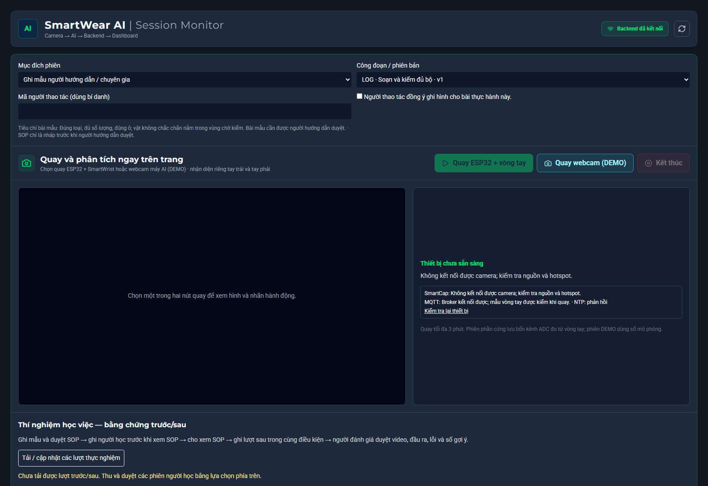
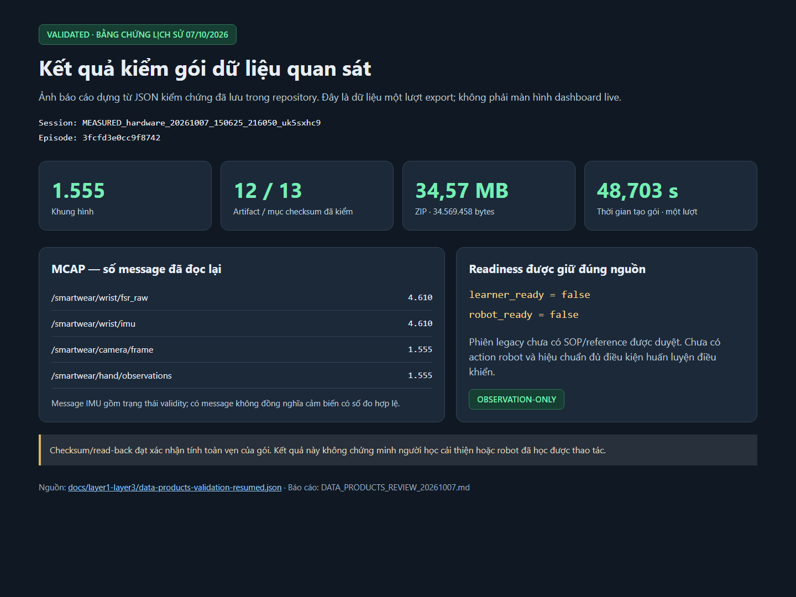
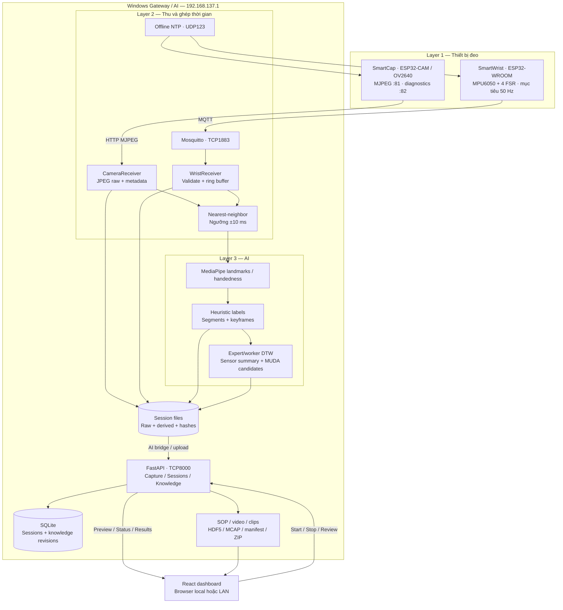
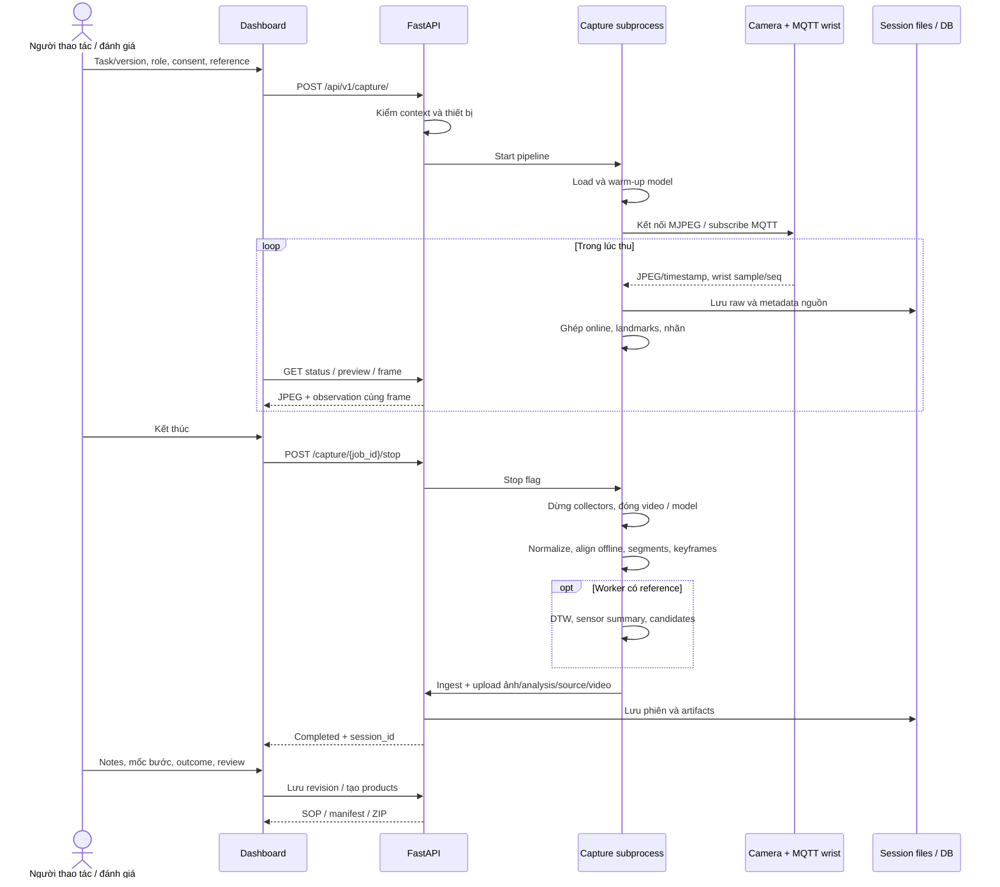
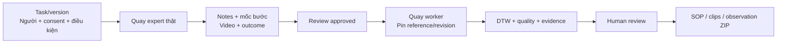

# SmartWear AI

**Ghi lại thao tác và bí quyết của người hướng dẫn, tạo Digital SOP có bằng chứng, và xuất dữ liệu quan sát cho nghiên cứu học máy/robot.**

SmartWear kết hợp camera FPV SmartCap và vòng tay SmartWrist để thu hình ảnh, timestamp, IMU khi khả dụng và bốn kênh FSR. Gateway nhận MJPEG/MQTT, ghép thời gian, chạy MediaPipe và phân đoạn hành động. Backend lưu phiên, phục vụ dashboard, quản lý reference/SOP được duyệt và xuất gói dữ liệu có manifest/checksum.

Cập nhật **09/10/2026**, đối chiếu mã nguồn và báo cáo trong `docs/`. Đây là nguyên mẫu; kết quả kiểm phần mềm, kết nối phần cứng, chất lượng dữ liệu và hiệu quả học việc được ghi riêng theo bằng chứng.

## Mục lục

1. [Mục tiêu và chức năng](#1-mục-tiêu-và-chức-năng)
2. [Ảnh giao diện và kết quả](#2-ảnh-giao-diện-và-kết-quả)
3. [Kiến trúc hệ thống](#3-kiến-trúc-hệ-thống)
4. [Luồng dữ liệu đầu cuối](#4-luồng-dữ-liệu-đầu-cuối)
5. [Đồng bộ và hợp đồng dữ liệu](#5-đồng-bộ-và-hợp-đồng-dữ-liệu)
6. [AI, điểm DTW và nghi vấn MUDA](#6-ai-điểm-dtw-và-nghi-vấn-muda)
7. [Cấu trúc repository](#7-cấu-trúc-repository)
8. [Cài đặt và chạy](#8-cài-đặt-và-chạy)
9. [Workflow expert, worker và SOP](#9-workflow-expert-worker-và-sop)
10. [CLI và firmware](#10-cli-và-firmware)
11. [API và cấu hình](#11-api-và-cấu-hình)
12. [Artifacts và sản phẩm dữ liệu](#12-artifacts-và-sản-phẩm-dữ-liệu)
13. [Kiểm chứng và kiểm thử](#13-kiểm-chứng-và-kiểm-thử)
14. [Xử lý sự cố](#14-xử-lý-sự-cố)
15. [Giới hạn, lộ trình và tài liệu](#15-giới-hạn-lộ-trình-và-tài-liệu)

## 1. Mục tiêu và chức năng

Hai hướng ứng dụng:

- **Số hóa bí quyết:** liên kết video với bước công việc, lời hướng dẫn, lý do, mẹo, lỗi và tiêu chí đầu ra được con người xác nhận.
- **Dữ liệu quan sát cho học máy:** giữ camera, landmarks, ADC/IMU, timestamps, validity và nhãn được duyệt trong gói tải được, kiểm lại được. Nhánh điều khiển robot cần thêm action/state robot và hiệu chuẩn.

| Chức năng | Hiện trạng |
| --- | --- |
| ESP32-CAM + SmartWrist | MJPEG/MQTT thật; lưu raw trước suy luận |
| Webcam DEMO | Nguồn mô phỏng riêng, không tự fallback khi mất phần cứng |
| Nhận diện | Capture hiện tại phân biệt hai tay; SmartWrist đo ở tay phải |
| Phân đoạn và DTW | Heuristic labels, timeline/keyframe từng tay, so nhãn/thời lượng |
| Dashboard | Start/stop, preview, trạng thái thiết bị, phiên và kết quả |
| Tri thức chuyên gia | Task/version, expert/worker, reference approved, notes/review revisions |
| Learner package | SOP HTML, video, clip khi có mốc, reference và evidence |
| Observation package | HDF5, MCAP JSON, manifest, validity, checksum/read-back |
| Học việc trước/sau | Form và báo cáo đã có; cần thực nghiệm người tham gia |
| Robot policy training | Chưa sẵn sàng; sản phẩm robot bị chặn khi thiếu điều kiện |

Task seed: **LOG_KIT v1** (soạn/kiểm bộ) và **HAND_ASSEMBLY v1** (lắp bulông–long đen–đai ốc bằng tay). Đây là bài mẫu cần người hướng dẫn duyệt, chưa phải SOP DENSO đã phê duyệt.

## 2. Ảnh giao diện và kết quả

### Dashboard hiện tại



*Ảnh ứng dụng thật chụp bằng Chrome headless ngày 09/10/2026. Backend kết nối; tại thời điểm chụp camera chưa kết nối, API chưa có phiên trong danh sách. Đây là màn hình chuẩn bị capture, chưa phải kết quả expert/worker. Trạng thái thiết bị cần kiểm lại trước khi quay.*

### Khung hình SmartCap


*Preview lịch sử 07/10/2026, ảnh gốc QVGA 320×240 đã có trong tài liệu. Chứng minh đường thu ảnh ở lượt đó; chưa nghiệm thu độ rõ chi tiết 10 mm hay chất lượng thao tác.*

### Kiểm gói dữ liệu



*Ảnh báo cáo dựng từ [JSON kiểm chứng](docs/layer1-layer3/data-products-validation-resumed.json), không phải widget live. Mở [trang báo cáo nguồn](docs/assets/readme/data-products-report.html). Tính toàn vẹn gói đạt; phiên legacy này có `learner_ready=false`, `robot_ready=false`.*

## 3. Kiến trúc hệ thống



| Thành phần | Công nghệ và vai trò |
| --- | --- |
| SmartCap | ESP32-CAM AI-Thinker, OV2640, Arduino/PlatformIO; JPEG QVGA. Không có IMU đầu. |
| SmartWrist | ESP32-WROOM, MPU6050/4 ADC FSR; task lấy mẫu tách MQTT; báo missing IMU khi không đọc được. |
| Gateway | Mosquitto, NTP offline Python, MQTT/MJPEG receivers, buffer hữu hạn. |
| AI | Python/OpenCV/MediaPipe, ghép offline, phân đoạn, DTW và provenance. |
| Backend | FastAPI/Pydantic/SQLAlchemy/SQLite; quản lý capture subprocess, ingest, knowledge và products. |
| Frontend | React/TypeScript/Vite/Tailwind/Recharts; API và overlay khớp frame. |
| Export | HTML/PDF, MP4/H.264 qua FFmpeg, h5py/HDF5, MCAP, ZIP và SHA-256. |

Một máy Windows hiện làm hotspot, gateway, AI và backend. Browser từ xa điều khiển camera của máy chủ/ESP32; webcam trên máy khách không được truyền trực tiếp vào pipeline.

## 4. Luồng dữ liệu đầu cuối



Preview phục vụ quan sát lúc thu; ghép offline dùng raw toàn phiên. JPEG được lưu trước inference, nên raw FPS và AI FPS có thể khác khi CPU chậm. Preview encode/write trên luồng riêng, mục tiêu khoảng 10 Hz; không phải tốc độ acquisition.

Dashboard hiện chạy một capture mỗi máy chủ, tối đa khoảng **180 giây**. Reload dùng job ID để lấy trạng thái; không mở thêm consumer camera.

## 5. Đồng bộ và hợp đồng dữ liệu

| Dịch vụ / thiết bị | Địa chỉ hiện tại |
| --- | --- |
| Mobile Hotspot | `192.168.137.1`, SSID `ok123`, 2.4 GHz |
| SmartCap stream / diagnostics | `http://192.168.137.111:81/stream` / `:82/status` |
| SmartWrist | `192.168.137.100` — publish, không phải broker |
| MQTT / topic | `.1:1883` / `wearable/user01/wrist/data` |
| NTP | `.1:123/UDP` |
| Backend | `.1:8000` hoặc `127.0.0.1:8000` trên máy chủ |

Camera dùng timestamp nguồn frame DMA chuyển sang epoch theo anchor NTP. MQTT giữ epoch/sequence nguồn; receive timestamps được lưu riêng. Không dùng giờ nhận ảnh để giả thời điểm chụp.

- Online ring buffer **100 mẫu**; đợi tối đa khoảng **40 ms** tìm mẫu gần nhất, chỉ nhận khi delta **≤10 ms** mặc định. 40 ms là thời gian đợi mạng, không phải ngưỡng ghép.
- Offline dùng toàn bộ raw wrist, báo matched/missing và delta mean/p95/max.
- Ngoài ngưỡng: `wrist=null`, `delta_ms=null`; hardware không fallback simulator.
- Boot/sequence/clock reset được kiểm; không ghép xuyên lần khởi động.
- NTP stratum 10 lấy giờ Windows làm mốc LAN; không chứng minh UTC chuẩn hay clock error <2 ms.

Ví dụ cấu trúc MQTT, **không phải số đo của phiên thật**:

```json
{
  "t_ms": 1791110000000,
  "seq": 123,
  "acc": null,
  "gyro": null,
  "force": [120, 340, 560, 0],
  "imu_status": "unavailable"
}
```

IMU hợp lệ có `acc`/`gyro` ba số; firmware quy định g và độ/giây, metadata phải phản ánh trạng thái xác minh. FSR là bốn số nguyên ADC 0–4095, chưa phải Newton. FSR dùng GPIO32/33/34/35; MPU6050 SDA21/SCL22, 3,3 V và GND chung. Kiểm đúng dây/ngón thực trước khi diễn giải kênh.

Schema chính: `smartwear.camera.v2`, `smartwear.sensors.v2`, `smartwear.multimodal.v2`, `smartwear.action_segments.v2`, `smartwear.analysis_comparison.v2`. Metadata/manifest giữ nguồn và SHA-256. Xem [CONTRACT](docs/layer1-layer3/CONTRACT.md).

## 6. AI, điểm DTW và nghi vấn MUDA

### Nhãn quan sát

MediaPipe cung cấp 21 landmarks/handedness. Heuristic dùng góc ngón, tốc độ cổ tay tương đối kích thước lòng bàn tay và lịch sử pose:

| Nhãn | Cách diễn giải |
| --- | --- |
| `OPEN` | Tư thế mở, ít chuyển động |
| `REACH` | Tư thế mở, chuyển động vượt ngưỡng |
| `GRAB` | Tư thế ngón co/nắm |
| `ASSEMBLY` | Nắm giữ ≥800 ms, chuyển động thấp; chưa chứng minh vật đã lắp |
| `RELEASE` | Chuyển từ nắm sang mở |
| `OTHER` / `NO_HAND` | Không xác định rõ / không thấy tay |

Pose cần ổn định nhiều frame. Segmentation gom nhãn/tracking status liên tiếp từng tay; keyframe chọn gần giữa thời gian đoạn. Nhãn GRAB không chứng minh lấy đúng linh kiện, ASSEMBLY không chứng minh chất lượng sản phẩm.

### Công thức chấm điểm hiện tại

Điểm worker đo độ giống **chuỗi nhãn và thời lượng** với reference, DTW độc lập từng tay:

```text
Khác nhãn: local_cost = 2.0
Cùng nhãn, thời lượng a/b bằng ms:
    local_cost = min(0.5, 0.25 × abs(ln((a + 1) / (b + 1))))
Bước ghép lặp expert hoặc worker: thêm 0.75
normalized_dtw_cost = tổng chi phí đường DTW / số cặp
weight mỗi tay = min(số đoạn expert, số đoạn worker)
score = 100 / (1 + trung bình normalized_dtw_cost có trọng số)
```

Chi phí 0 / 0,25 / 0,5 tương ứng 100 / 80 / 66,7 điểm. Nhanh hơn hoặc chậm hơn mẫu đều có thể giảm điểm. Missing/ambiguous được ghi riêng, không chấm như đúng. Tay không có cặp so được không tham gia trung bình; nếu cả hai thiếu, bước so có thể báo lỗi. Bridge có fallback worker score 0 khi không có weighted cost.

**Role khác worker nhận baseline 100 trong bridge**, không phải nghiệm thu chuyên gia. FSR/IMU, độ rung tay, lực vật lý, quỹ đạo 3D, độ chính xác lắp và sản phẩm đạt/chưa đạt chưa tham gia công thức. Sensor summary được báo riêng; measured/demo khác nguồn không tự trừ cho nhau.

Nguồn: [compare_sessions.py](ai/analysis/compare_sessions.py), [backend_bridge.py](ai/integration/backend_bridge.py), [hand_observation.py](ai/hand_observation.py).

### MUDA cần con người xem lại

`longer_visible_action` cần đoạn cùng nhãn ghép đủ rõ, dài hơn **≥500 ms và ≥1,5 lần**. Quy tắc bổ sung tìm đoạn ngắn hơn/thêm/lặp/thiếu có điều kiện riêng; đoạn thêm thường cần ≥300 ms. Camera thiếu/mơ hồ không tự được coi là bỏ sót.

`muda_detected_seconds` tổng hợp thời lượng nghi vấn hoặc thời gian tăng thêm; hai tay có thể chồng thời gian. Chưa phải thời gian lãng phí đã xác nhận. Người đánh giá cần xem video/nguyên nhân; chưa có model TCN/ensemble hoặc detector rung tay đã benchmark.

## 7. Cấu trúc repository

```text
smartwear-ai-software/
├── firmware/                 # ESP32 targets, network/pinout, PlatformIO
├── ai/
│   ├── hardware/             # MQTT, MJPEG, NTP, alignment, capture, preflight
│   ├── preprocessing/        # normalize, multimodal, segments, keyframes
│   ├── analysis/             # DTW, references, sensors, MUDA
│   ├── integration/          # dashboard worker và backend bridge
│   ├── sensors/              # mô phỏng DEMO tách nguồn
│   ├── generated_data/       # sessions và reference artifacts
│   ├── camera_test.py
│   └── hand_observation.py
├── backend/
│   ├── api/ core/            # routes, auth, config, logging, exceptions
│   ├── db/ models/ repositories/ schemas/
│   ├── services/             # capture, knowledge, SOP, episode products
│   ├── websocket/ mock/ tests/
│   ├── data/ static/         # database, logs, artifacts
│   └── main.py
├── frontend/
│   ├── src/                  # dashboard và các panels
│   ├── package.json
│   └── dist/                 # bản build, gitignored
├── deployment/               # start, monitor, validation, benchmark scripts
├── docs/                     # runbook, evidence, demo, roadmap, ảnh
├── .venv/                    # venv riêng máy hiện tại, gitignored
└── README.md
```

## 8. Cài đặt và chạy

### Yêu cầu và cài lần đầu

Windows Mobile Hotspot 2.4 GHz cho phần cứng, Python **3.12 64-bit** theo runbook, Node.js/npm phù hợp package/lockfile và Mosquitto. Cần webcam nếu thử DEMO. SmartCap/SmartWrist phải có nguồn ổn định và firmware khớp SSID/subnet.

```powershell
cd D:\MyProject\Denso2\smartwear-ai-software
py -3.12 -m venv .venv
.\.venv\Scripts\python.exe -m pip install -r ai\requirements-hardware.txt
.\.venv\Scripts\python.exe -m pip install -r backend\requirements-dev.txt pytest platformio==6.2.0
npm.cmd ci --prefix frontend
npm.cmd run build --prefix frontend
```

Bỏ qua tạo/cài lại nếu môi trường đã hoạt động. Venv không portable giữa máy; không dùng `ai/.venv` cũ. Dependencies pin tại [AI requirements](ai/requirements-hardware.txt), [backend requirements](backend/requirements.txt), [package.json](frontend/package.json). Secrets cục bộ tạo từ mẫu khi cần flash; không đưa mật khẩu vào README.

### Khởi động phần cứng

Bật hotspot `ok123`, mật khẩu khớp secrets, 2.4 GHz; kiểm máy có `.1`. Các terminal đều mở tại root dự án. Kiểm listener trước để tránh dịch vụ trùng:

```powershell
Get-NetTCPConnection -State Listen -ErrorAction SilentlyContinue |
    Where-Object LocalPort -in 1883,8000 |
    Select-Object LocalAddress,LocalPort,OwningProcess
Get-NetUDPEndpoint -LocalPort 123 -ErrorAction SilentlyContinue
```

**Terminal 1 — MQTT**, nếu chưa có broker đúng cấu hình:

```powershell
& 'C:\Program Files\mosquitto\mosquitto.exe' -c .\deployment\mosquitto.conf -v
```

**Terminal 2 — NTP**, nếu chưa có UDP123:

```powershell
.\.venv\Scripts\python.exe -B ai\hardware\ntp_server.py
```

**Terminal 3 — backend:**

```powershell
powershell.exe -NoProfile -ExecutionPolicy Bypass -File deployment\start-backend.ps1
```

**Terminal 4 — kiểm tra:**

```powershell
. .\deployment\hardware.ps1
.\.venv\Scripts\python.exe -B ai\hardware\preflight.py --output backend\data\manual-preflight.json
Invoke-RestMethod http://127.0.0.1:8000/ready
Invoke-RestMethod http://127.0.0.1:8000/api/v1/capture/devices | ConvertTo-Json -Depth 8
```

Mở **http://127.0.0.1:8000/** hoặc **http://192.168.137.1:8000/** trên cùng hotspot. Giữ terminal dịch vụ mở. Backend phục vụ `frontend/dist`, không cần Vite để dùng. `/ready` xác nhận app đã khởi tạo; thiết bị kiểm riêng. Preflight TCP/NTP chưa chứng minh JPEG/MQTT samples.

### Webcam DEMO và phát triển giao diện

Backend đã chạy: chọn **Quay webcam (DEMO)** và role DEMO. API `capture_mode=demo` dùng webcam máy chủ và sensor mô phỏng, không mở ESP32/wrist. Expert/worker có context yêu cầu hardware đo thật. Hai nguồn chọn rõ, không tự fallback.

Lập trình frontend, giữ backend 8000 rồi chạy:

```powershell
npm.cmd run dev --prefix frontend
```

Vite proxy `/api` và `/ws` về backend. Build lại khi cần phục vụ mã mới ở cổng 8000. Xem [hướng dẫn chạy đầy đủ](docs/HUONG_DAN_CHAY_DU_AN.md).

## 9. Workflow expert, worker và SOP



1. Chuẩn bị vật/ánh sáng/góc FPV; người hướng dẫn xác nhận quy trình và đầu ra.
2. Chọn task/version, role expert, bí danh, consent thật; quay rồi kết thúc, chờ lưu.
3. Điền instruction/why/tips/errors, mốc từng bước và evidence. Reviewer xem video, outcome/clarity rồi duyệt. Mẫu đúng không nhất thiết nhanh nhất.
4. Worker chọn reference approved cùng task/version, giữ điều kiện tương đương.
5. Xem DTW/ảnh/video/quality; người đánh giá xác nhận lỗi và sản phẩm.
6. Tạo ZIP, giải nén đầy đủ, mở `learner/sop.html` với media tương đối đi kèm.

Thí nghiệm học việc: **trước học → xem SOP → sau học**, cùng participant/task/version/reference/review và điều kiện tương đương; giữ cả thất bại, số lỗi/gợi ý và mốc thật. Cycle time không bằng thời lượng quay; một cặp chưa chứng minh hiệu quả tổng quát.

Đọc [LEARNING_EXPERIMENT](docs/demo-kit/LEARNING_EXPERIMENT.md), [EVIDENCE](docs/demo-kit/EVIDENCE.md), [kịch bản 120 giây](docs/KICH_BAN_VIDEO_DEMO_120_GIAY.md).

## 10. CLI và firmware

Dừng capture dashboard trước CLI, một consumer camera mỗi thời điểm:

```powershell
. .\deployment\hardware.ps1
.\.venv\Scripts\python.exe -B ai\hardware\raw_capture.py --duration-s 10
.\.venv\Scripts\python.exe -B ai\hardware\record_hardware.py --headless --duration-s 60 --process --publish --role expert
```

Worker dùng đường dẫn expert thật:

```powershell
$expertSessionPath = 'D:\MyProject\Denso2\smartwear-ai-software\ai\generated_data\sessions\TEN_PHIEN_EXPERT_THAT'
.\.venv\Scripts\python.exe -B ai\hardware\record_hardware.py --headless --duration-s 60 --process --publish --role worker --expert-session $expertSessionPath
```

CLI không thay đầy đủ context/consent/review của dashboard. Raw ngắn kiểm nhận mẫu; nghiệm thu rate/stability cần lượt dài phù hợp, ít nhất 60 giây theo runbook.

Chỉ flash khi cần đổi firmware/cấu hình. Dừng capture, đóng monitor, xác minh đúng bo/cổng trước upload:

```powershell
. .\deployment\hardware.ps1
.\.venv\Scripts\python.exe -m serial.tools.list_ports -v
.\.venv\Scripts\python.exe -m platformio run -d firmware
.\.venv\Scripts\python.exe -m platformio run -d firmware -e smartcap -t upload --upload-port COM5
.\.venv\Scripts\python.exe -m platformio run -d firmware -e smartwrist -t upload --upload-port COM7
```

COM5/COM7 là cấu hình gần nhất, có thể đổi. **Mở serial kể cả không reset có thể reset ESP32-CAM-MB**, không mở khi thu. `smartcap_wifi_diag` chỉ chẩn đoán; target camera thường là `smartcap`.

## 11. API và cấu hình

Swagger: **http://127.0.0.1:8000/docs**. Bảng endpoint dưới prefix `/api/v1`, trừ health/readiness:

| Method | Endpoint | Mục đích |
| --- | --- | --- |
| GET | `/health`, `/ready` | Liveness/app readiness, ngoài prefix |
| GET | `/capture/devices` | Camera/MQTT/NTP, cache khoảng 5 giây |
| POST | `/capture/?capture_mode=hardware` hoặc `demo` | Start; context tùy workflow |
| GET / POST | `/capture/{job_id}` / `/capture/{job_id}/stop` | Status/stop |
| GET | `/capture/{job_id}/preview`, `/frame` | Observation/JPEG preview |
| POST | `/sessions/ingest` | Validate/upsert AI payload, idempotent theo ID |
| GET | `/sessions/`, `/sessions/{id}` | List/detail |
| GET / PUT | `/sessions/{id}/analysis-result` | Phân tích đầy đủ |
| GET / PUT | `/sessions/{id}/recording`, `/source-data` | AVI/ZIP nguồn |
| GET | `/sessions/{id}/download-sop`, `/export-rosbag` | Export legacy, phải đọc provenance |
| GET / POST | `/knowledge/procedures` | Task/version |
| GET | `/knowledge/references` | References approved |
| GET / PUT | `/knowledge/sessions/{id}` | Notes/review revisions |
| GET | `/knowledge/sessions/{id}/quality` | Source quality report |
| POST | `/knowledge/sessions/{id}/products` | Generate/cache |
| GET | `/knowledge/sessions/{id}/products/{kind}` | Learner/observation/manifest; robot trả 409 |
| GET | `/knowledge/learning-trials`, `/knowledge/learning-experiment` | Báo cáo trước/sau |

WebSocket `/ws/live-stream` broadcast telemetry validate; `?simulate=true` dành cho mock telemetry, chưa chứng minh phần cứng end-to-end. Capture preview chính dùng HTTP polling status/JPEG/observation.

| Biến môi trường | Vai trò |
| --- | --- |
| `SMARTWEAR_AI_PYTHON` | Python AI, script hardware đặt `.venv` |
| `SMARTWEAR_CAMERA_URL` | URL SmartCap |
| `SMARTWEAR_MQTT_HOST/PORT/TOPIC` | Broker/topic, không trỏ host tới wrist |
| `SMARTWEAR_ALIGNMENT_WINDOW_MS` | Mặc định `10` |
| `SMARTWEAR_CAPTURE_MODE` | Capture worker hardware/demo; API chọn mode rõ |
| `SMARTWEAR_CAPTURE_BACKEND_URL` | Bridge publish về backend |
| `SMARTWEAR_DATABASE_URL` | SQLite mặc định `backend/data/smartwear.db` |
| `SMARTWEAR_API_KEY` | REST header `X-API-Key`, WS query `api_key` khi được cấu hình |
| `SMARTWEAR_ENVIRONMENT` | Development/test/production; production cần API key |
| `SMARTWEAR_CORS_ORIGINS` | JSON array hoặc chuỗi phân cách dấu phẩy |
| `PLATFORMIO_CORE_DIR` | `.platformio` root |

Mosquitto config anonymous trên LAN riêng. Firewall khi cần giới hạn TCP1883/8000, UDP123 cho subnet dự kiến; xem [RUNBOOK](docs/layer1-layer3/RUNBOOK.md). Cấu hình demo này không dành để forward dịch vụ ra Internet.

## 12. Artifacts và sản phẩm dữ liệu

```text
ai/generated_data/sessions/hardware_<time>_<id>/
  camera_raw.mjpeg / camera_packets.jsonl / wrist_raw.jsonl
  hardware_capture.json / capture_manifest.json / performance.json
  camera.jsonl / camera.avi / camera.video.json
  camera.normalized.jsonl
  real_sensors.jsonl / real_sensors.meta.json
  multimodal.jsonl
  action_segments.json / keyframes.json / keyframes/
  session_role.json / capture_context.json
  analysis_result.json                  # khi có so sánh
  backend_payload_measured.json / *.meta.json
  backend_*_measured.receipt.json
```

Backend DB ở `backend/data`, ảnh/source/analysis liên quan tại `backend/static/images`; SOP/dataset legacy tại `backend/static/pdf` và `backend/static/dataset`. Episode products gắn session/version, manifest chỉ rõ paths.

| Gói | Nội dung |
| --- | --- |
| Learner | HTML SOP, reference/worker video, notes, clips/sidecars theo mốc; readiness cần review/evidence |
| Observation | HDF5 timestamps/arrays/validity; MCAP JSON channels; manifest, nguồn/checksums |
| Source/AVI | Dữ liệu AI và video gốc để tải/tái lập |
| Legacy ROSbag/JSON | Export tồn tại; DEMO trajectory/force không phải tọa độ/action thật |

Hai đường ZIP learner/observation hiện chứa cùng portable bundle đầy đủ, khác tên; chưa phải hai archive rút gọn độc lập. MCAP JSON không tự là adapter ROS2 control. IMU missing giữ mask false/null, ADC không đổi Newton. Measured bridge để robot trajectory rỗng và peak force Newton null.

Giữ raw/hash/roles lịch sử; khi pipeline/nguồn đổi tạo derived version phù hợp. Readiness learner/robot là hai trạng thái riêng.

## 13. Kiểm chứng và kiểm thử

Các số thuộc **các phiên khác nhau**, không phải một lượt tổng hợp và không phải LIVE:

| Bằng chứng | Kết quả | Nguồn |
| --- | --- | --- |
| Raw phục hồi 07/10 | 1.035 JPEG, 3.003 wrist samples/60 s; 17,250 FPS, 50,050 Hz; không lỗi stream/seq/malformed ghi nhận trong lượt đó | [Verification](docs/layer1-layer3/VERIFICATION-20261007.md) |
| Ghép `142254…i1uwuwl2` | 1.061/1.063 frame, 99,81%; p95 9 ms/max 10 ms; phiên này không thấy tay | [Verification](docs/layer1-layer3/VERIFICATION-20261007.md) |
| Hiệu suất `114208…b97nj0sz` 09/10 | 315 JPEG/312 inferred; 0 dropped_for_inference, 3 ảnh còn queue; AI 15,59 FPS, wrist 49,96 Hz; inference p95 50,877 ms | [Improvements](docs/IMPROVEMENTS_20261009.md) |
| Episode `3fcfd3e0cc9f8742` | 1.555 frames/12 artifacts/13 checksum; ZIP 34.569.458 bytes; generation 48,703 s một lượt; readiness false | [JSON read-back](docs/layer1-layer3/data-products-validation-resumed.json) |
| Python đầu lượt cải tiến 09/10 | 77 tests + 14 subtests passed; targeted sau đó ghi riêng | [Improvements](docs/IMPROVEMENTS_20261009.md) |
| Frontend | TypeScript/Vite build đạt; warning bundle >500 kB còn | [Improvements](docs/IMPROVEMENTS_20261009.md) |

Lượt viết README chụp giao diện, đọc API và kiểm tài liệu, không chạy lại toàn bộ suite/thu người tham gia/benchmark. API hiện có thể khác lịch sử; không nhập lại session chỉ để tạo ảnh kết quả.

Kiểm phần mềm khi thay mã:

```powershell
.\.venv\Scripts\python.exe -B -m pytest ai backend/tests --ignore=ai/generated_data -q
.\.venv\Scripts\python.exe -B deployment\verify-ai.py
npm.cmd run build --prefix frontend
git diff --check
```

Kiểm gói của session thật đang tồn tại trên backend, thay placeholder và output:

```powershell
.\.venv\Scripts\python.exe -B deployment\validate-data-products.py --url http://127.0.0.1:8000/api/v1/knowledge/sessions/MEASURED_SESSION_ID/products/observation --output backend\data\products-validation-NEW.json
```

Fixture không phải dữ liệu công nhân. Build/upload firmware đạt chưa chứng minh JPEG/sensor/KPI thật.

## 14. Xử lý sự cố

| Hiện tượng | Kiểm tra / xử lý |
| --- | --- |
| Dashboard không mở | Listener 8000, `/ready`, `frontend/dist/index.html`; build rồi start |
| Backend ready/camera unavailable | Hotspot `.1`, nguồn/cáp SmartCap, diagnostics `:82/status`; trạng thái app và thiết bị riêng |
| NTP bind lỗi/camera 503 | IP `.1`, UDP123, firewall; reset bo sau khi dịch vụ sẵn sàng và hết capture |
| MQTT mở nhưng không mẫu | Wrist, topic, broker `.1`; preflight TCP chưa thử payload |
| JPEG timeout/seq reset | Nguồn/cáp, consumer trùng, boot ID; không ghép xuyên reboot, giữ raw lỗi |
| COM Access denied | Đóng monitor/Arduino; kiểm COM, không flash khi thu |
| Không có đoạn để so | Góc/ánh sáng, task/reference, missing tay; không tạo nhãn giả |
| UnknownPlatform | Dot-source `deployment/hardware.ps1` dùng `.platformio` repo |
| Cổng bị chiếm | Kiểm PID/command line, dùng dịch vụ đúng hiện có |

Dừng: **Kết thúc quay → chờ xử lý/lưu → Ctrl+C** ở terminal backend/NTP/MQTT do bạn khởi động. Nếu chạy nền, tìm PID hiện tại qua listener, xác minh command line rồi dừng đúng tiến trình. Không dùng PID lịch sử, không dừng toàn bộ Python, không restart backend khi capture đang chạy.

Chi tiết: [hướng dẫn chạy](docs/HUONG_DAN_CHAY_DU_AN.md), [camera incident](docs/layer1-layer3/CAMERA-INCIDENT-20261007-EVENING.md), [COM troubleshooting](docs/layer1-layer3/COM7-TROUBLESHOOTING.md).

## 15. Giới hạn, lộ trình và tài liệu

### Giới hạn

- QVGA 320×240; chưa chứng minh WVGA/720p 30 FPS hoặc định vị <2 mm.
- Không có IMU đầu; wrist IMU có lịch sử unavailable, FSR kênh 4 có lịch sử chưa phản hồi. Cần kiểm từng kênh trước thí nghiệm.
- ADC chưa hiệu chuẩn Newton; chưa có torque/hand-to-robot coordinates đã kiểm chứng.
- DTW chưa là accuracy/quality %, độ đầy đủ dữ liệu phải đọc cùng điểm; nhãn AI và outcome cần review.
- Chưa có model TCN/ensemble và benchmark F1 công nghiệp.
- Chưa chứng minh giảm 50% thời gian đào tạo, ROI <6 tháng, <40 g hoặc BOM <1,5 triệu đồng; cần đo với phạm vi rõ.
- Observation-only, thiếu robot action/state/calibration/thử nghiệm; file MCAP/ROSbag không chứng minh robot đã học được.

### Lộ trình

1. Thu/duyệt reference hai task; người học trước/sau có evidence đầy đủ.
2. Kiểm FSR/IMU, ổn định dài hạn, clock/loss độc lập, hiệu chuẩn đại lượng dùng định lượng.
3. Mở rộng dữ liệu có consent/quyền sử dụng, split theo người/episode tránh leakage.
4. Chọn robot/action space, ghi command/state, validate mapping/adapter rồi train/evaluate.

### Tài liệu đọc tiếp

| Tài liệu | Nội dung |
| --- | --- |
| [HUONG_DAN_CHAY_DU_AN](docs/HUONG_DAN_CHAY_DU_AN.md) | Cài/start/stop, dashboard/CLI, lỗi |
| [RUNBOOK](docs/layer1-layer3/RUNBOOK.md) / [CONTRACT](docs/layer1-layer3/CONTRACT.md) | Triển khai, timestamp, pinout, missing/provenance |
| [IMPLEMENTATION_PROGRESS](docs/IMPLEMENTATION_PROGRESS.md) | Notes/review/export đã triển khai |
| [IMPROVEMENTS_20261009](docs/IMPROVEMENTS_20261009.md) | Diagnostics/hiệu suất/học việc |
| [DATA_PRODUCTS_ROADMAP](docs/DATA_PRODUCTS_ROADMAP.md) | Readiness gates và phát triển |
| [DEMO_TWO_WORKFLOWS](docs/DEMO_TWO_WORKFLOWS.md) | Task, vật dụng/checklist, sân khấu |
| [KICH_BAN_VIDEO_DEMO_120_GIAY](docs/KICH_BAN_VIDEO_DEMO_120_GIAY.md) | Timeline, pitch, overlay/fallback |
| [Ý tưởng dữ liệu công nhân](docs/Y_TUONG_DU_LIEU_CONG_NHAN_HUAN_LUYEN_HUMANOID.md) | Quan sát người tới nghiên cứu humanoid |
| [Backend README](backend/README.md) | API, persistence, cấu hình/export legacy |

README thành phần có thể có mô tả lịch sử/đường dẫn máy cũ; đối chiếu mã/runbook mới khi khác biệt. Capture hiện gọi `num_hands=2` và giữ trái/phải; cảm biến vật lý chỉ tay phải.

### Dữ liệu và license

Quản lý video/bí danh/consent/review theo mục đích sử dụng. Không đưa raw/private artifacts hoặc secrets lên Git để chia sẻ README. `.venv`, `.platformio`, `frontend/dist`, `frontend/node_modules`, `backend/data` được gitignore.

Repository chưa khai báo license dự án; dependencies có license riêng. Có mã nguồn/checksum không tự cấp quyền dùng video/notes cho training hoặc phát hành.
