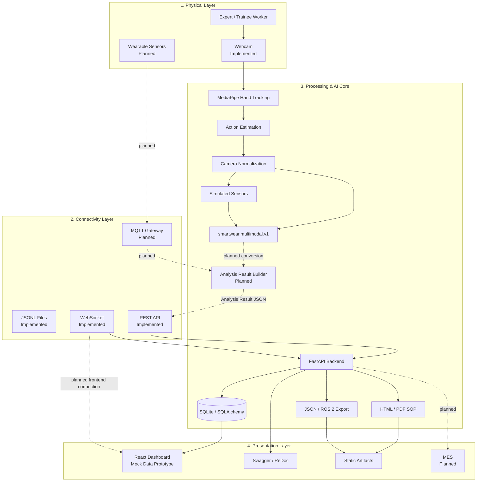
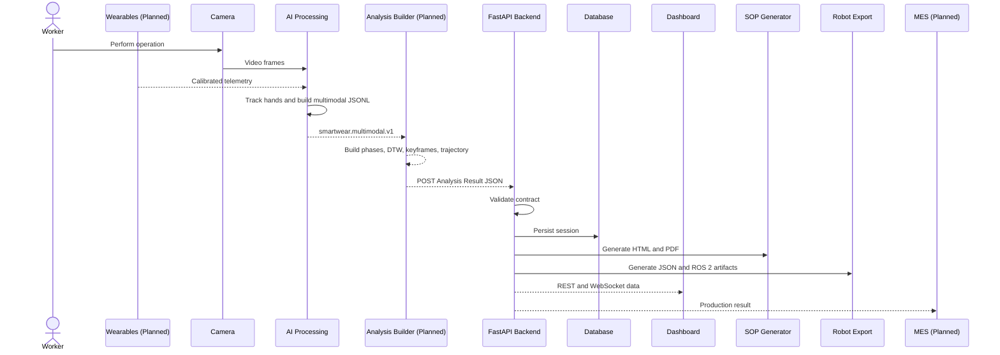

# SmartWear AI

<p align="center">
  
  
  
  
  
</p>

<p align="center">
  Capture manual-work observations, structure industrial knowledge, generate Digital SOPs, and export robot-compatible datasets.
</p>

> [!IMPORTANT]
> SmartWear AI is a prototype. Camera processing, multimodal preprocessing, backend ingestion, persistence, SOP generation, and robot export are implemented. Automatic conversion from AI multimodal output into the final Analysis Result contract is still planned.

## Overview

SmartWear AI explores how expert manual work can be captured and transformed into reusable industrial knowledge. The intended workflow observes expert actions, structures operation phases, detects production waste (muda), compares sessions, generates Digital SOPs, and exports robot training data.

The repository currently contains:

1. An AI camera and multimodal preprocessing pipeline.
2. A FastAPI backend with persistence and artifact generation.
3. A React dashboard prototype driven by mock telemetry.

The AI pipeline currently ends at frame-level `smartwear.multimodal.v1` JSONL. It does not yet calculate DTW metrics, produce calibrated robot trajectories, extract image keyframes, or publish the final Analysis Result automatically.

---

## Features

### Implemented

**AI and preprocessing**

- OpenCV webcam capture and MediaPipe Hand Landmarker.
- Up to two hands with handedness and 21 normalized/world landmarks.
- Heuristic labels: `REACH`, `GRAB`, `ASSEMBLY`, `RELEASE`, `OPEN`, `OTHER`, and `NO_HAND`.
- Raw/normalized camera JSONL and camera-conditioned simulated sensors.
- Exact timestamp alignment, SHA-256 provenance, `smartwear.multimodal.v1`, and tests.

**Backend**

- FastAPI, Pydantic v2, SQLAlchemy 2, and SQLite.
- Layered API, service, repository, schema, and model packages.
- Session, keyframe, dashboard, system, and WebSocket APIs.
- Optional API-key authentication, CORS, structured logging, and exception handling.
- HTML/PDF Digital SOP generation.
- JSON and ROS 2-compatible robot export.
- Static artifacts, OpenAPI documentation, Docker, and automated tests.

**Frontend**

- React and TypeScript dashboard prototype.
- Mock telemetry, landmark visualization, charts, cycle monitoring, muda alerts, and device indicators.

> [!NOTE]
> The frontend currently uses `MockDataEngine`; backend REST and WebSocket connectivity is planned.

### Planned

- Multimodal-to-Analysis Result conversion.
- DTW comparison, action-phase aggregation, and image keyframe extraction.
- Calibrated wearable measurements and robot-frame trajectories.
- AI REST/WebSocket publishing and MQTT streaming.
- Frontend/backend integration and MES connectivity.
- Database migrations, production observability, and identity management.

---

## System Architecture

SmartWear AI follows four layers:

1. **Physical:** webcam input is implemented; wearable IMU, force/EMG, and torque hardware are planned.
2. **Connectivity:** REST and WebSocket are implemented; direct AI publishing, MQTT, and MES transport are planned.
3. **Processing & AI Core:** MediaPipe capture, heuristic actions, multimodal preprocessing, backend validation, persistence, and artifact generation.
4. **Presentation:** React prototype, API documentation, SOPs, and robot exports.



### End-to-End Workflow

The backend workflow is complete once a valid Analysis Result arrives. The missing stage is the semantic transformation from multimodal AI records into that contract.



---

## Repository Structure

```text
smartwear-ai-software/
|-- ai/
|   |-- camera_test.py
|   |-- hand_observation.py
|   |-- process_recording.py
|   |-- hand_landmarker.task
|   |-- data/
|   |-- preprocessing/
|   `-- sensors/
|-- backend/
|   |-- api/
|   |-- core/
|   |-- db/
|   |-- mock/
|   |-- models/
|   |-- repositories/
|   |-- schemas/
|   |-- services/
|   |-- static/
|   |-- tests/
|   |-- websocket/
|   |-- Dockerfile
|   `-- main.py
|-- frontend/
|   |-- public/
|   |-- src/
|   `-- package.json
|-- shared/sample/
|   `-- analysis_result.example.json
|-- data/
|   |-- sessions/
|   `-- simulated/
|-- scripts/
|-- tests/
|-- requirements.txt
`-- test_mock.py
```

`ai/` owns capture and preprocessing; `backend/` owns APIs, persistence, SOPs, and robot export; `frontend/` contains the mock dashboard; `shared/sample/` holds the canonical contract; `data/` contains generated datasets; and `test_mock.py` posts the sample contract.

---

## AI Module

`ai/camera_test.py` opens the default webcam and runs MediaPipe Hand Landmarker in video mode. Recordings are saved as `ai/camera_data_<timestamp>.jsonl` with frame dimensions, hand landmarks, handedness, timestamps, and heuristic action estimates. Video and image keyframes are not saved.

`ai/hand_observation.py` estimates visible actions from finger angles, hand state, wrist movement, relative speed, and timing. These labels do not prove that a physical action occurred.

`ai/process_recording.py` performs:

```text
Raw camera JSONL
  -> Camera normalization
  -> Simulated sensor generation
  -> Exact timestamp join
  -> smartwear.multimodal.v1
```

```text
data/sessions/<recording>_<unique-id>/
|-- camera.normalized.jsonl
|-- sensors.jsonl
|-- sensors.meta.json
`-- multimodal.jsonl
```

> [!WARNING]
> `force_emg_raw` is unitless, and MediaPipe world landmarks are not robot-frame coordinates. Neither is a valid direct substitute for calibrated contract data.

- Preprocessing details: [`ai/preprocessing/README.md`](ai/preprocessing/README.md)
- Sensor details: [`ai/sensors/README.md`](ai/sensors/README.md)

---

## Backend Module

The backend validates Analysis Results, stores normalized sessions, calculates dashboard aggregates, handles keyframes, broadcasts telemetry, and generates artifacts. SQLAlchemy uses the `analysis_sessions`, `action_phases`, `dtw_metrics`, `robot_trajectory_points`, and `key_frames` tables.

Its REST and WebSocket interfaces cover ingestion, history, details, keyframes, KPIs, charts, downloads, telemetry, and health checks. See [`backend/README.md`](backend/README.md) for all endpoints and configuration.

Artifacts are written under `backend/static/pdf/` as HTML/PDF and `backend/static/dataset/` as JSON, DB3, and ROS bag ZIP files.

Robot exports use ROS 2 Humble pose and wrench types. Meaningful physical output requires calibrated positions and Newton force in the incoming contract.

---

## Interface Contract

The canonical Analysis Result is [`shared/sample/analysis_result.example.json`](shared/sample/analysis_result.example.json).

| Required field | Meaning |
| --- | --- |
| `session_id` | Unique session identifier |
| `worker_type` | `EXPERT` or `TRAINEE` |
| `key_frames` | Declared keyframe filenames |
| `action_phases` | Ordered, non-overlapping operation phases |
| `dtw_metrics` | Similarity score and muda duration |
| `robot_trajectory_points` | Ordered Cartesian position and force samples |

Action phases contain `phase`, `start_time`, `end_time`, and optional `peak_force_N`. DTW metrics contain `similarity_score` and `muda_detected_seconds`. Trajectory points contain `t`, `[x, y, z]`, and `force`. Unknown fields, unsafe names, non-finite values, overlapping phases, and unordered trajectories are rejected. Keyframe bytes are uploaded separately.

---

## Technology Stack

**Frontend:** React 19, TypeScript, Vite, Tailwind CSS, Recharts, and Lucide React. **Backend:** Python, FastAPI, Pydantic v2, SQLAlchemy 2, SQLite, Uvicorn, and WebSocket. **AI:** OpenCV and MediaPipe. **Artifacts:** ReportLab, HTML, `rosbags`, ROS 2 Humble types, and SQLite DB3. **Deployment:** Docker with Python 3.12 slim.

---

## Installation

Prerequisites: Git, Python 3.11+, a webcam for capture, Node.js/npm for the frontend, and optionally Docker.

```bash
git clone https://github.com/jBoy2m5/smartwear-ai-software.git
cd smartwear-ai-software
```

### AI

No dedicated locked AI requirements file currently exists.

```bash
python -m venv ai/.venv
python -m pip install opencv-python mediapipe
python -B ai/camera_test.py
```

Press `Q` to stop capture and begin processing. To process an existing recording:

```bash
python -B ai/process_recording.py --input ai/camera_data_<timestamp>.jsonl
```

### Backend

```bash
python -m venv backend/.venv
backend/.venv/bin/python -m pip install -r backend/requirements-dev.txt
backend/.venv/bin/python -m uvicorn backend.main:app --reload
```

On Windows, use `backend\.venv\Scripts\python.exe`. The API runs at `http://127.0.0.1:8000`.

### Frontend

```bash
cd frontend
npm install
npm run dev
```

The Vite console displays the URL. The current UI uses mock telemetry.

### Docker

```bash
docker build -t smartwear-backend backend
docker run --rm -p 8000:8000 -e SMARTWEAR_API_KEY=change-me smartwear-backend
```

Production mode requires `SMARTWEAR_API_KEY`.

---

## Testing and API Documentation

```bash
backend/.venv/bin/python -m unittest discover -s backend/tests -v
python -B -m unittest discover -s ai/preprocessing -p "test_*.py" -v
python -B -m unittest discover -s ai/sensors -p "test_*.py" -v
```

With the backend running: Swagger is at `/docs`, ReDoc at `/redoc`, OpenAPI at `/openapi.json`, liveness at `/health`, and readiness at `/ready` on `http://127.0.0.1:8000`.

REST authentication uses `X-API-Key`; WebSocket authentication uses the `api_key` query parameter when configured.

---

## Demo Workflow

Start the backend and submit the canonical contract:

```bash
python -m uvicorn backend.main:app --reload
python -m pip install -r requirements.txt
python test_mock.py
```

Use Swagger UI to inspect the session, dashboard metrics, SOPs, and robot exports. The AI demo currently runs separately:

```text
Worker -> Webcam -> MediaPipe -> Action estimates
       -> Normalized camera data -> Simulated sensors
       -> smartwear.multimodal.v1
```

Automatic contract generation and backend publishing remain planned.

---

## Screenshots

- **Dashboard:** Screenshot placeholder for the React telemetry dashboard.
- **Digital SOP:** Screenshot placeholder for generated HTML or PDF.
- **Swagger UI:** Screenshot placeholder for the FastAPI interface.
- **Architecture:** Screenshot placeholder for clients that do not render Mermaid.

---

## Roadmap

### Completed

- [x] Webcam capture and MediaPipe tracking.
- [x] Hand-state/action heuristics.
- [x] Camera normalization and simulated sensors.
- [x] Timestamp-aligned multimodal output with provenance.
- [x] FastAPI, validation, SQLAlchemy, and dashboard APIs.
- [x] WebSocket broadcasting and static artifacts.
- [x] HTML/PDF SOP generation.
- [x] JSON and ROS 2-compatible export.
- [x] Docker backend definition.
- [x] React mock dashboard and automated tests.

### In Progress

- [ ] Convert multimodal records into the Analysis Result contract.
- [ ] Define phase aggregation and extract keyframes.
- [ ] Connect the frontend to backend REST/WebSocket APIs.
- [ ] Replace simulated values with calibrated measurements.

### Future Work

- [ ] DTW comparison against versioned expert references.
- [ ] Robot base-frame calibration.
- [ ] MQTT and MES integration.
- [ ] Database migrations, identity, and role-based access.
- [ ] Production observability, CI, and deployment manifests.

---

## Contributors

### Person A - AI & Data Processing

- Camera capture and MediaPipe tracking.
- Sensor preprocessing and action estimation.
- Multimodal generation and AI tests.

### Person B - Backend & Integration

- FastAPI, database, REST, and WebSocket architecture.
- Validation, dashboard APIs, and error handling.
- Digital SOPs, robot exports, tests, and Docker support.

The frontend prototype is not currently assigned to a named contributor.

---

## Data and Safety

- Camera labels are heuristic observations, not proof of physical actions.
- Simulated telemetry is not measured worker data.
- `force_emg_raw` is unitless and is not Newton force.
- MediaPipe world landmarks are not robot-frame coordinates.
- Safety-critical automation requires calibrated data, validation, and appropriate industrial controls.

## License

This repository does not currently include a license file. A license should be added before public distribution or open-source use.
