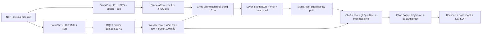

# SmartWear AI: triển khai Layer 1 → Layer 3

Cập nhật ngày 06/10/2026. Mọi code, cấu hình, log và tài liệu của đợt triển khai này nằm trong repo hiện tại.

## Địa chỉ và quyết định triển khai

| Thành phần | Địa chỉ | Chức năng |
|---|---|---|
| SmartCap / AI-Thinker ESP32-CAM | `192.168.137.111:81/stream` | HTTP multipart JPEG QVGA, timestamp DMA, seq |
| SmartWrist / ESP32-WROOM | `192.168.137.100` | MQTT publisher 50 Hz, không phải broker |
| Máy Layer 2 + Layer 3 | `192.168.137.1` | MQTT TCP 1883, NTP UDP 123, AI/backend TCP 8000 |
| Router | `192.168.137.1`, subnet `/24` | Windows Mobile Hotspot, cùng máy MQTT/NTP |

Máy tạo Windows Mobile Hotspot `192.168.137.1` đồng thời chạy Gateway Layer 2 và AI Layer 3. Cấu hình hotspot mới của người dùng thay toàn bộ cấu hình mạng triển khai cũ. Xem [HOTSPOT.md](HOTSPOT.md) để bật dịch vụ và nạp lại firmware.

SSID Mobile Hotspot (không có dấu cách cuối): `ok123`. Dùng Wi-Fi 2.4 GHz. Mật khẩu đã được đưa vào `firmware/include/secrets.h` cục bộ (gitignored); file mẫu không chứa mật khẩu thật. File nhị phân firmware cũng chứa thông tin Wi-Fi, không đưa lên kho công khai.

## Các tệp cần đọc

- [RUNBOOK.md](RUNBOOK.md): cài đặt, bật dịch vụ, nạp bo, thu dữ liệu và xử lý.
- [CONTRACT.md](CONTRACT.md): hợp đồng dữ liệu, thời gian, chân cảm biến, giới hạn.
- [AUDIT.md](AUDIT.md): rà soát theo thành phần và các lỗi đã sửa.
- [VALIDATION.md](VALIDATION.md): kết quả kiểm thử và hạng mục chưa nghiệm thu.
- [preflight.json](preflight.json): kết quả kiểm tra kết nối thật từ máy đang làm việc.

## Luồng đã triển khai

Ghép online phục vụ callback và preview; ghép offline dùng toàn bộ raw MQTT để tạo bộ dữ liệu phiên có hash kiểm tra. Bộ xử lý ảnh có queue giới hạn: JPEG raw được lưu trước, frame AI có thể ít hơn raw khi máy xử lý chậm.

## Trạng thái bàn giao

Đã đổi cấu hình firmware, bộ nhận Python, MQTT/NTP và script sang Mobile Hotspot `ok123` / `192.168.137.0/24`. Hai bo đã nạp bản cấu hình mạng cũ ở phiên trước; cần nạp lại bản hotspot mới. Ở lần kiểm tra ngày 06/10/2026, Windows chưa liệt kê cổng COM và chưa thấy adapter `192.168.137.1`, nên chưa thể xác nhận phần cứng hoạt động trên hotspot.

Layer 3 hiện dùng MediaPipe + heuristic phân đoạn + so sánh chuỗi/ADC. Chưa có mô hình TCN/ensemble được huấn luyện hay tập nhãn để chứng minh F1 >88%; chưa có hiệu chuẩn lực Newton hoặc tọa độ robot. Không đánh đồng pipeline chạy được với các KPI đã đạt.
